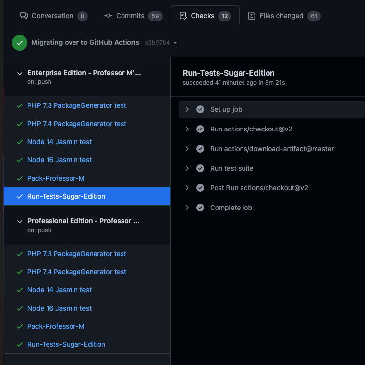

# Professor M's School for Gifted Coders [](https://travis-ci.org/sugarcrm/school)

All of the tutorials at UnCon 2017 will be based on Professor M's School for Gifted Coders.  The following sections will explain more about the scenario and how to install the required modules and sample data.

## Contents
[About the scenario](#about-the-scenario) 

[Installation instructions](#installation-instructions) 

[Setting up your development environment](#setting-up-your-development-environment) 

[Generating the Professor M module loadable packages locally](#generating-the-professor-m-module-loadable-packages-locally) 

[Continuous integration with Travis CI](#continuous-integration-with-travis-ci) 

[Continuous integration with Jenkins](#continuous-integration-with-jenkins) 

[Automated tests](#automated-tests)

[How to fix your Sugar instance without starting completely over](#how-to-fix-your-sugar-instance-without-starting-completely-over)

## About the scenario
Professor M aka Professor Marum has created an exclusive not-for-profit school for gifted coders.  

Learn more about the implemented [Use Cases](docs/UseCases.md) in the [docs](docs/).

Want a quick summary? Watch the video below we put together for SugarCon 2017.
[](https://youtu.be/aKBTKcaney4 "The Professor M Scenario Part 1 - What is it and why should you care?")

## Installation instructions

Before beginning any of the tutorials associated with UnCon 2017, you'll want to setup a Sugar instance that has the Professor M scenario installed.

Watch the video below for instructions on how to install the scenario.  Text-based instructions follow.
[](https://youtu.be/SO-Rav35X5U "The Professor M Scenario Part 2 - How do you install it?")

### Prerequisites
- Sugar 7.9.1.0 (or newer) installed with NO sample data.  See [Getting Started with Sugar Development](https://developer.sugarcrm.com/getting-started) for help.
   * Note:  If you install Sugar using ***config_si.php***, ensure that the `disable_unknown_platforms` property is set to `false` or is not in the file.
   * Note for Windows users:  Make the path to your Sugar instance as short as possible to avoid errors of file paths being too long.
- [Postman](https://www.getpostman.com) installed 

### Install the modules and customizations
We've created a custom package you can install.  The package will create and customize the modules you'll need for the scenario.  The following instructions will walk you throw how to install the package.
1. Download **sugarcrm-ProfessorM-standard.zip** from the latest [release](https://github.com/sugarcrm/school/releases)
1. Login to Sugar as an Administrator
1. Navigate to **Administration** > **Module Loader**
1. Upload **sugarcrm-ProfessorM-standard.zip**
1. Click **Install** for the ProfessorM package
1. Review and accept the license agreement
1. Click **Commit**
   * Hint for Windows users:  If you receive a warning with the message "Full extraction path exceed MAXPATHLEN (260)...", try the following:
     1. Download **sugarcrm-ProfessorM-windows.zip** from the latest [release](https://github.com/sugarcrm/school/releases).
     1. Install the zip as a module loadable package using the steps above.
     1. Download **sugarcrm-ProfessorM-windows-manual-install.zip** from the latest [release](https://github.com/sugarcrm/school/releases).
     1. Unzip the file. Note that you'll find **ProfMForWindowsReadme.txt** and a set of directories inside of the zip.
     1. Open **ProfMForWindowsReadme.txt**.
     1. Follow the instructions inside of the readme to manually copy the files from the zip to your Sugar instance.  You
     may need to create directories in your Sugar directory if they do not already exist.
     1. Navigate to **Administration** > **Repair** > **Quick Repair and Rebuild**.
   * If the above installation still fails due to a MAXPATHLEN error, we recommend generating the zips yourself locally 
   on your own machine.  See 
   [Generating the Professor M module loadable packages locally](#generating-the-professor-m-module-loadable-packages-locally) 
   for instructions on how to do so.
   
   
### Customize the modules that are displayed
Sugar will display many modules by default that you will not be using while working on the tutorials.  To make things simpler, we'll hide the modules that won't be used and rearrange the modules that are displayed.
1. Login to Sugar as an Administrator if you have not already done so
1. Go to **Administration** > **Display Modules and Subpanels**
1. Drag the following modules from the **Displayed Modules** box to the **Hidden Modules** box:
   * Calendar
   * Calls
   * Meetings
   * Tasks
   * Notes
   * Emails
   * Campaigns
   * Targets
   * Target Lists
   * Forecasts
   * Processes
   * Process Business Rules
   * Documents
   * Cases
   * Tags
1. Rearrange the items in the **Displayed Modules** box so they are in the following order from top to bottom:
   * Accounts
   * Leads
   * Contacts
   * Professors
   * Opportunities
   * Revenue Line Items
   * Quotes
   * Reports
   * Process Email Templates
   * Process Definitions
1. Click **Save**

### Use the Sugar REST API to create the Professor M sample data
In order to create the Professor M sample data, you'll use Postman to run a collection of Sugar REST API calls.  Each call in the collection has one or more simple tests associated with it to ensure the call was successful.
1. Save a copy of [ProfessorM_PostmanCollection.json](https://raw.githubusercontent.com/sugarcrm/uncon/2017/ProfessorM/ProfessorM_SampleData/ProfessorM_PostmanCollection.json)
1. In Postman, click **Import**
1. Click **Choose Files** and import **ProfessorM_PostmanCollection.json**
1. Click the gear icon in the upper right corner and select **Manage Enviornments**
1. Click **Add** 
1. Input a name for your environment (for example, **Professor M**)
1. Add the following keys and values:
   * url: the url of your Sugar installation (for example, http://localhost:8888/profm)
   * rest_endpoint:  /rest/v10
   * username:  the username for an admin user in your Sugar installation
   * password:  the password associated with the username above
1. Click **Add**
1. Close the **Manage Environments** dialog
1. Click **Runner**
1. Select the **ProfessorM Sample Data** collection
1. Ensure the environment you just created is selected
1. Click **Run ProfessorM S...**
1. Wait for the collection to finish running. All tests should pass.
   Hint:  If you see many failures, you may have forgotten to install the Professor M module loadable package.  See the 
   instructions in previous section for how to do the install.


## Setting up your development environment
If you want to generate the Professor M module loadable packages yourself or make changes to the code in this repo, you
will need to set up a development environment.  You do NOT need to set up a development environment if you simply want
to install the Professor M scenario as-is in your Sugar instance.

1. Checkout or download a copy of this repo.
1. [Install PHP 7](http://php.net/manual/en/install.php).
1. [Install Composer](https://getcomposer.org/download/). We use Composer to install the PHP dependencies for the project.  
1. Execute the following command from your `school` directory in order to install the dependencies:
```
composer install
```

You may also want to set up your development environment so you can execute the unit tests.  See 
[Automated tests](#automated-tests) for more information.


## Generating the Professor M module loadable packages locally
The Professor M module loadable packages can be found on the [Releases](https://github.com/sugarcrm/school/releases) 
page of this GitHub repo.  You may want to generate the module loadable packages yourself if you are a Windows user with 
a long Sugar directory path or if you want to make changes to the package.

1. [Set up your development environment](#setting-up-your-development-environment) if you have not already done so.
1. In a shell, navigate to the `package` directory inside of your `school` directory.
1. For standard builds, execute ```./pack.php -v versionNameOrNumber```
1. For Windows builds where installing the standard build results in MAXPATHLEN errors, 
execute ```./pack.php -v versionNameOrNumber -w lengthOfWindowsSugarDirectoryPath```


## Continuous integration with Travis CI
This repository is configured to work with [Travis CI](https://docs.travis-ci.com/user/for-beginners/).  Whenever a commit
is pushed to the repository or a Pull Request is made, Travis CI will automatically kick off a build.

### Viewing results in Travis CI

You can view the Travis CI build results at [https://travis-ci.org/sugarcrm/school](https://travis-ci.org/sugarcrm/school).

### Viewing results in GitHub

You can view the latest build status at the top of this README ([](https://travis-ci.org/sugarcrm/school)).  
Clicking on the build status will open the detailed results in Travis CI.

You can also view build results in Pull Requests.  Toward the bottom of each Pull Request, you can click "Show all 
checks" to see the Travis CI build results for that Pull Request.  


You can then click Details to open the build results in Travis CI.



### About the build

The build is configured in [.travis.yml](.travis.yml). Currently, the build has two stages:
- test
- Build & Post on GitHub

The test stage is run first and has two jobs:
  - Execute the PHPUnit tests (see [PHPUnit tests](#phpunit-tests) for details)
  - Execute the Jasmine tests (see [Jasmine tests](#jasmine-tests) for details)
  
If the test stage passes and the build is being run against the master branch, the Build & Post on GitHub stage will be 
kicked off. This stage executes the pack.php script to generate the Professor M module loadable packages as zips. The 
zips will be automatically posted to GitHub: https://github.com/sugarcrm/school/releases.

If you want the Build & Post on GitHub stage to be kicked off for a branch other than master, you should do **both** of 
the following in [.travis.yml](.travis.yml).
- Remove the "if: branch = master" in the `stages` section
- Add the branch as an option in the deploy section. For example:
```$xslt
    deploy:
      provider: releases
      file: releases/sugarcrm-ProfessorM-latest.zip
      api_key:
          secure: mykey
      skip_cleanup: true
      on:
        branch: mybranchname
```

We hope to expand the build to do more (like deploy Sugar) in the future.

## Continuous integration with Jenkins
This repository can be configured for continuous integration with [Jenkins](https://jenkins-ci.org/).  Jenkins can be configured so that
whenever a commit is pushed to the repository or at certain time intervals, Jenkins will automatically kick off a build.

### Installing Jenkins

Before beginning, you'll need to set up your own installation of Jenkins.  Check out the 
[Jenkins Installation Guide](https://jenkins.io/doc/book/installing/) for more details.  We recommend installing the 
Jenkins suggested plugins.

### Creating a Jenkins project

Once you have Jenkins set up, you'll want to create a new project in Jenkins that will build the school project. 

1. On the Jenkins dashboard, click **New Item**.
1. Name your new item something like **ProfessorM**.  
1. Select **Freestyle project** and click **OK**. The item configuration page will display.
1. In the **Source Code Management** section, select **Git.**
1. Input your Repository URL (for example, `https://github.com/sugarcrm/school`) and add your credentials.
1. Configure the Build Triggers section as you'd like. If you do not want to configure this now, you can skip this step
and manually trigger the builds instead.
1. You do not need to configure anything in the Build Environment section.
1. In the **Build** section, click **Add build step** and select **Execute shell**. 
1. In the **Command** box that appears, input the following: `bash -ex buildPackageInJenkins.sh`
1. In the **Post-build Actions** section, click **Add post-build action** and select **Archive the artifacts**.
1. In the **Files to archive** box that appears, input the following: `package/releases/*.zip`
1. In the **Post-build Actions** section, click **Add post-build action** and select **Delete workspace when build is done**.
1. Click **Save**.

### Running a build and viewing the results

Once you have your Jenkins project created, it's time to see if it works!

Navigate to your ProfessorM project in Jenkins. Trigger your build manually by clicking **Build Now**.

View the Build History panel to quickly browse the build results.  If you see a blue dot, you know all of the tests passed!


Click on a build to view more details.  If the build passed, the Professor M module loadable packages will be stored as 
build artifacts.


To see more details on a build, click **Console Output**.  If any step in the process fails (for example, a Jasmine test
fails), the remaining steps will not be run.  If everything succeeds, you'll be able to find the Jasmine test results,
the PHPUnit test results, and the results of the Professor M module loadable packages being generated, copied, and archived. 

Jasmine results:


PHPUnit results:


Professor M package results:


Tip:  If you see errors in the Console Output about git not being found, you may need to update your Jenkins configuration.
On the Jenkins dashboard, click **Manage Jenkins**. Click **Conifgure System**. In the **Global Properties** section,
enable the **Tool Locations** checkbox. In the Name box, select **(Git) Default**.  In the Home box, input the path
to the Git installation (for example, `/usr/bin/git`).  Click **Save**.

Tip for those running Jenkins in Docker:  If you see errors in the Console Output similar to 'Fatal error: Unable to 
find local grunt', you may need to update your Jenkins job.  The likely cause is that your 
`LOCALWORKSPACEPATH` is not pointing to the path of the workspace that is storing the school repo's files that are being pulled out of 
GitHub.  You can diagnose if this is the issue by adding `docker exec my-yarn pwd` and `docker exec my-yarn ls` around 
line 13 to see what is in the `workspace` directory after the `docker run` command has mounted the volume.  If you do 
not see files from the school repo in the `workspace`, you need to update `LOCALWORKSPACEPATH`. The easiest way to 
update `LOCALWORKSPACEPATH` is to pass in the correct value (for example `/Users/lschaefer/jenkins/workspace/ProfessorM`)
as an argument when you call the script.  Open the configure page for your Jenkins job and update the Build step to have
a script like `bash -ex buildPackageInJenkins.sh /Users/lschaefer/jenkins/workspace/ProfessorM`.

### About the build

The build has 3 major parts
1. Run the Jasmine tests
1. Run the PHPUnit tests
1. Generate the Professor M module loadable packages and archive the results

The heart of the build is in [buildPackageInJenkins.sh](buildPackageInJenkins.sh).  The shell script relies on Docker images 
stored on [Docker Hub](https://hub.docker.com/r/sugarcrmdev/school) in order to implement the three parts listed above. [The sugarcrmdev/school Docker Hub repository](https://hub.docker.com/r/sugarcrmdev/school) 
stores two images:
- The `yarn` image has all of the dependencies managed by Yarn installed in it.  The shell script uses this image to run 
the Jasmine tests.
- The `composer` image has all of the dependencies managed by Composer installed in it. The shell script uses this image 
to run the PHPUnit tests as well as to generate the Professor M module loadable packages.

Note:  if any step in the process fails (for example, a Jasmine test fails), the remaining steps will not be run.

## Automated tests
This repository contains automated PHPUnit and Jasmine tests that can be executed manually or as part of a
 [Travis CI](http://travis-ci.com) build.

### PHPUnit tests
[PHPUnit](https://phpunit.de/) is a testing framework for PHP.  The PHPUnit test files are located in 
[/tests/phpunit](tests/phpunit).  The [/tests/phpunit](tests/phpunit) directory can contain 
multiple test files, and each test file can contain multiple tests.

### Manual execution
To manually execute the tests, you will need to use Composer to install PHPUnit and other PHP dependencies.
If you have not installed Composer before, visit the [Composer Getting Started Guide](https://getcomposer.org/doc/00-intro.md).

You'll also need to install [Composer](https://getcomposer.org/) to manage your dependencies.  See 
[Download Composer](https://getcomposer.org/download/) for instructions on how to download Composer to your machine.  
Then execute the following command from your `school` directory in order to install the test dependencies:
```
composer install
```

If you need to update the namespaces, manually update [composer.json](composer.json) and then run the following command from
your `school` directory:
```
./composer.phar update
```

The PHPUnit tests can be executed by running the following command from your `school` directory on macOS:
```
vendor/bin/phpunit
```
or on Windows:
```
vendor\bin\phpunit
```

### Automatic execution
The PHPUnit tests are automatically run as part of the Travis CI build process.  Travis CI's default build script
for PHP is PHPUnit, so we don't have to include anything special in [.travis.yml](.travis.yml) in order for the tests 
to run.  However, we have added `composer install` to [.travis.yml](.travis.yml) in order for the dependencies to be 
installed on the build machine. Travis CI looks in [phpunit.xml](phpunit.xml) for the PHPUnit config.  Our config 
indicates that the PHPUnit tests are stored in [tests/phpunit](tests/phpunit).  

#### Interpreting the results
To see the results of the tests that are run as part of the Travis CI build, open the build in Travis CI.  If the build 
passed, you know all of the tests passed.


To see the detailed test results, click the PHP build job to expand it:


You can scroll through the job log to see the results of the PHPUnit tests.


If the build failed, a variety of things could have caused the failure including a failing PHPUnit test.


If a PHPUnit test fails, you'll see something like the following in the job log.


### Jasmine tests
[Jasmine](https://jasmine.github.io/) is a testing framework for JavaScript.  We have included a very simple Jasmine 
test in this repository as an example.

The tests are located in [/tests/jasmine](tests/jasmine).  Currently, there is one test inside of the 
[DummySpec.js](tests/jasmine/DummySpec.js) test file.  The [/tests/jasmine](tests/jasmine) directory can contain 
multiple test files, and each test file can contain multiple tests.

### Manual execution
To manually execute the tests, you will need to install a few different things on your machine before you can run the 
tests. 

#### Setup
Install Yarn which is an NPM compatible package manager. See [Yarn Installation Guide](https://yarnpkg.com/lang/en/docs/install/) for more details on how to install Yarn.

Next navigate to your school directory and then execute the following commands. 

Install the JavaScript dependencies using Yarn. These dependencies include Grunt, Jasmine, and Phantomjs.
```
yarn install
```

Install the Grunt command line interface globally. See [Grunt's Getting Started Guide](https://gruntjs.com/getting-started) for more details on installing and using Grunt.
```
yarn global add grunt-cli
```

#### Execution
Inside of your `school` directory, execute the following command to run the Jasmine tests:
```
grunt test-js
```

### Automatic execution
The Jasmine tests are automatically run as part of the Travis CI build process.  Travis CI will automatically look
for a script named "test" inside of [package.json](package.json).  In our case, the test script calls the "test-js" task
defined in [Gruntfile.js](Gruntfile.js).  The "test-js" task only has one task:  jasmine.

#### Interpreting the results
To see the results of the tests that are run as part of the Travis CI build, open the build in Travis CI.  If the build 
passed, you know all of the tests passed.


To see the detailed test results, click the Node.js build job to expand it:


You can scroll through the job log to see the results of the Jasmine tests.


If the build failed, a variety of things could have caused the failure including a failing Jasmine test.


If a Jasmine test fails, you'll see something like the following in the job log.


## How to fix your Sugar instance without starting completely over

As you customize this instance, you may do something like accidentally write broken code that seems to break your Sugar instance.  Try running **Quick Repair and Rebuild**:
1. Log in as an administrator.
1. Click your profile picture in the upper-right corner and select **Administration**.
1. In the **System** section, click **Repair**.
1. Click **Quick Repair and Rebuild**.

If you become unable to login to your Sugar instance or running **Quick Repair** does not work, try the following:

1. Remove the custom code that is causing problems.
1. Delete the contents of the `cache` directory.
1. Use a program like MySQL Workbench to truncate the `metadata_cache` table.
1. Access your Sugar instance in a browser. If you still receive an error, reload the page.

If the above steps do not fix your problem, you may need to start over.  Delete your Sugar root directory and follow the steps in the Installation Instructions above.
