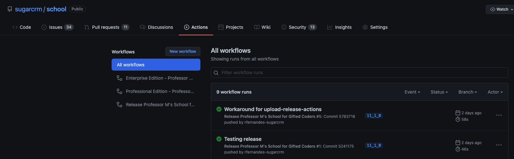

# Professor M's School for Gifted Coders

[](https://github.com/sugarcrm/school/actions/workflows/ci-professional.yml)

[](https://github.com/sugarcrm/school/actions/workflows/ci-enterprise.yml)

[](https://github.com/sugarcrm/school/actions/workflows/ci-release.yml)

Professor M's School for Gifted Coders is a module loadable package that can be installed in Sugar.  The following 
sections explain more about the scenario and how to install the package and sample data.

## Contents
[About the scenario](#about-the-scenario) 

[Installation instructions](#installation-instructions) 

[Setting up your development environment](#setting-up-your-development-environment) 

[Contribute to this project](#contribute-to-this-project)

[Generating the Professor M module loadable packages locally](#generating-the-professor-m-module-loadable-packages-locally) 

[Continuous integration with Github Actions](#continuous-integration-with-github-actions) 

[Automated tests](#automated-tests)

[How to fix your Sugar instance without starting completely over](#how-to-fix-your-sugar-instance-without-starting-completely-over)

## About the scenario
Professor M aka Professor Marum has created an exclusive not-for-profit school for gifted coders.  

Learn more about the implemented [Use Cases](docs/UseCases.md) in the [docs](docs/).

Want a quick summary? Watch the video below.
[](https://youtu.be/aKBTKcaney4 "The Professor M Scenario Part 1 - What is it and why should you care?")

## Installation instructions

Watch the video below for instructions on how to install the scenario.  Text-based instructions follow.
[](https://youtu.be/SO-Rav35X5U "The Professor M Scenario Part 2 - How do you install it?")

### Prerequisites
- Sugar 11.2 (or newer) installed with NO sample data. See [Getting Started with Sugar Development](https://developer.sugarcrm.com/getting-started) for help.
   * Note:  If you install Sugar using ***config_si.php***, ensure that the `disable_unknown_platforms` property is set to `false` or is not in the file.
   * Note for Windows users:  Make the path to your Sugar instance as short as possible to avoid errors of file paths being too long.
   * Professor M's install leverages Administration [REST API](https://support.sugarcrm.com/Documentation/Sugar_Developer/Sugar_Developer_Guide_11.2/Integration/Web_Services/REST_API/Endpoints/Administrationpackages_POST/) to install Module Loadable Package available on Sugar 11.2 and up
- [Postman](https://www.getpostman.com) installed 

### Install the modules and customizations
We've created a custom package you can install.  The package will create and customize the modules you'll need for the scenario.  The following instructions will walk you throw how to install the package.
1. Download the appropriate zip file from the latest [release](https://github.com/sugarcrm/school/releases). If you are
installing in Sugar Cloud, you will need to select the **production** version of the release.  If you are installing
elsewhere, you can select the **production** release or the **standard** release.  The **standard** release includes 
automated testing files while the **production** release does not.
1. Login to Sugar as an Administrator
1. Navigate to **Administration** > **Module Loader**
1. Upload **sugarcrm-ProfessorM-standard.zip**
1. Click **Install** for the ProfessorM package
1. Review and accept the license agreement
1. Click **Commit**
   * Hint for Windows users:  If you receive a warning with the message "Full extraction path exceed MAXPATHLEN (260)...", try the following:
     1. Download **sugarcrm-ProfessorM-windows.zip** from the latest [release](https://github.com/sugarcrm/school/releases).
     1. Install the zip as a module loadable package using the steps above.
     1. Download **sugarcrm-ProfessorM-windows-manual-install.zip** from the latest [release](https://github.com/sugarcrm/school/releases).
     1. Unzip the file. Note that you'll find **ProfMForWindowsReadme.txt** and a set of directories inside of the zip.
     If no directories are inside the zip, then all file paths in the `package/src` directory have been deemed short 
     enough to be included in a typical Windows installation and you will need to generate the zips yourself locally 
     on your own machine (see [Generating the Professor M module loadable packages locally](#generating-the-professor-m-module-loadable-packages-locally) 
     for instructions on how to do so).
     1. Open **ProfMForWindowsReadme.txt**.
     1. Follow the instructions inside of the readme to manually copy the files from the zip to your Sugar instance.  You
     may need to create directories in your Sugar directory if they do not already exist.
     1. Navigate to **Administration** > **Repair** > **Quick Repair and Rebuild**.
   * If the above installation still fails due to a MAXPATHLEN error, we recommend generating the zips yourself locally 
   on your own machine.  See 
   [Generating the Professor M module loadable packages locally](#generating-the-professor-m-module-loadable-packages-locally) 
   for instructions on how to do so.
   

### Customize the modules that are displayed
Sugar will display many modules by default that you will not be using while working on the tutorials.  To make things simpler, we'll hide the modules that won't be used and rearrange the modules that are displayed.
1. Login to Sugar as an Administrator if you have not already done so
1. Go to **Administration** > **Display Modules and Subpanels**
1. Drag the following modules from the **Displayed Modules** box to the **Hidden Modules** box:
   * Calendar
   * Calls
   * Meetings
   * Tasks
   * Notes
   * Emails
   * Targets
   * Target Lists
   * Forecasts
   * Documents
   * Cases
   * Tags
1. Rearrange the items in the **Displayed Modules** box so they are in the following order from top to bottom:
   * Accounts
   * Leads
   * Contacts
   * Professors
   * Opportunities
   * Revenue Line Items
   * Quotes
   * Reports
   * Campaigns
   * Process Email Templates
   * Process Definitions
   * Process Business Rules
   * Processes
1. Click **Save**

### Use the Sugar REST API to create the Professor M sample data
In order to create the Professor M sample data, you'll use Postman to run a collection of Sugar REST API calls.  Each call in the collection has one or more simple tests associated with it to ensure the call was successful.
1. Save a copy of [ProfessorM_PostmanCollection.json](https://raw.githubusercontent.com/sugarcrm/school/master/data/ProfessorM_PostmanCollection.json)
1. In Postman, click **Import**
1. Click **Choose Files** and import **ProfessorM_PostmanCollection.json**
1. Click the gear icon in the upper right corner and select **Manage Enviornments**
1. Click **Add** 
1. Input a name for your environment (for example, **Professor M**)
1. Add the following keys and values:
   * url: ```the url of your Sugar installation for example: http://sugar-web1/sugar```
   * rest_endpoint: ```/rest/v11_14```
   * username:  ```the username for an admin user in your Sugar installation```
   * password:  ```the password associated with the username above```
1. Click **Add**
1. Close the **Manage Environments** dialog
1. Click **Runner**
1. Select the **ProfessorM Sample Data** collection
1. Ensure the environment you just created is selected
1. Click **Run ProfessorM S...**
1. Wait for the collection to finish running. All tests should pass.
   Hint:  If you see many failures, you may have forgotten to install the Professor M module loadable package.  See the 
   instructions in previous section for how to do the install.
   
If you are using an Enterprise or Ultimate edition of Sugar, you can use the features that leverage Advanced Workflow.
Save a copy of [ProfessorM_PostmanCollection_AdvancedWorkflow.json](https://raw.githubusercontent.com/sugarcrm/school/master/data/ProfessorM_PostmanCollection_AdvancedWorkflow.json) and (https://raw.githubusercontent.com/sugarcrm/school/master/data/Application_Routing.bpm) to your local filesystem. Update the reference to Application_Routing.bpm in ProfessorM_PostmanCollection_AdvancedWorkflow.json to point to your local filesystem location for that file. Then follow the steps above to import the collection and run it.

## Setting up your development environment
If you want to generate the Professor M module loadable packages yourself or make changes to the code in this repo, you
will need to set up a development environment.  You do NOT need to set up a development environment if you simply want
to install the Professor M scenario as-is in your Sugar instance.

1. Checkout or download a copy of this repo.
1. [Install PHP 7](http://php.net/manual/en/install.php).
1. [Install Composer](https://getcomposer.org/download/). We use Composer to install the PHP dependencies for the project.  
1. Execute the following command from your `school/package` directory in order to install the dependencies:
```
composer install
```

You may also want to set up your development environment so you can execute the unit tests.  See 
[Automated tests](#automated-tests) for more information.

## Contribute to this project
Professor M's School is [open source](https://github.com/sugarcrm/school/blob/master/LICENSE), and we would love for you 
to get involved!  Below are some ways you can contribute to this project:
- Get notifications about this repo by clicking the **Watch** button at the top of this 
[repo](https://github.com/sugarcrm/school).
- Explore the code and use it as a resource as you develop your integrations and customizations.
- Create a [new Issue](https://github.com/sugarcrm/school/issues/new) if you have ideas for improvement, a feature 
request, or a bug report.
- Assign yourself an Issue, update the code, and create a pull request.  See [CONTRIBUTING.MD](docs/CONTRIBUTING.md) for
more details.


### ZenHub
We utilize ZenHub to organize our backlog and track our Issues.  You can view our ZenHub board inside the GitHub web 
interface if you have a [ZenHub browser extension](https://www.zenhub.com/extension) installed.  You can also view our 
ZenHub board at 
[https://app.zenhub.com/workspace/o/sugarcrm/school/boards?repos=109023666](https://app.zenhub.com/workspace/o/sugarcrm/school/boards?repos=109023666). 

When viewing our ZenHub board, you can view our prioritized backlog as well which stories are currently in progress, 
blocked, under review, and closed.  


## Generating the Professor M module loadable packages locally
The Professor M module loadable packages can be found on the [Releases](https://github.com/sugarcrm/school/releases) 
page of this GitHub repo.  You may want to generate the module loadable packages yourself if you are a Windows user with 
a long Sugar directory path or if you want to make changes to the package.

1. [Set up your development environment](#setting-up-your-development-environment) if you have not already done so.
1. In a shell, navigate to the `package` directory inside of your `school` directory.
1. For standard builds, execute ```./pack.php -v versionNameOrNumber```
1. For Windows builds where installing the standard build results in MAXPATHLEN errors, 
execute ```./pack.php -v versionNameOrNumber -w lengthOfWindowsSugarDirectoryPath```


## Continuous integration with GitHub Actions
This repository is configured to work with [GitHub Actions](https://github.com/features/actions/).  Whenever a commit
is pushed to the repository or a Pull Request is made, Github Actions will automatically kick off a build.
When a merge is pushed to ```master``` branch a build will kick off to release and tag this version.

### Viewing results in GitHub Actions

You can view the GitHub Actions build results at [https://github.com/sugarcrm/school/actions](https://github.com/sugarcrm/school/actions).

### Viewing results in GitHub 


You can view the latest build status at the top of this README or just below.
Clicking on the build status will open the detailed results in GitHub Actions.

[](https://github.com/sugarcrm/school/actions/workflows/ci-professional.yml)

[](https://github.com/sugarcrm/school/actions/workflows/ci-enterprise.yml)

[](https://github.com/sugarcrm/school/actions/workflows/ci-release.yml)


You can also view build results in Pull Requests.  Toward the bottom of each Pull Request, you can click "Show all 
checks" to see the GitHub Actions build results for that Pull Request.  


You can then click Details to open the build results in Travis CI.


### About the build

The build has six Environment Variables that have been configured in the secrets section Professor M's school project:
- ```SUGARCRM_USERNAME```: The username for an account that has access to the 
[SugarCRM Developer Builds Space](https://community.sugarcrm.com/community/developer/developer-builds) and the [Sugar
Store](https://store.sugarcrm.com/download)
- ```SUGARCRM_PASSWORD```: The password associated with the above account
- ```GTB_USERNAME```: The username for a GitHub account that has access to https://github.com/sugarcrm/unit-tests
- ```GTB_PASSWORD```: The ```token``` associated with the above account
- ```SUGAR_ENTERPRISE_LICENSE_KEY```: Enterprise sugar license key used in our Ent install
- ```SUGAR_PROFESSIONAL_LICENSE_KEY```: Professional sugar license key used in our Pro install


This project provides 3 different workflows for CI build:
- [Sugar Enterprise Edition](.github/workflows/.ci-enterprise.yml)
- [Sugar Professional Edition](.github/workflows/.ci-professional.yml)
- [Professor-M Release](.github/workflows/.ci-release.yml)

For Sugar Edition's workflows, we have the following jobs:
- Test-PackageGenerator-PHP - tests PackageGenerator in different PHP versions
- Test-PackageGenerator-PHP - tests PackageGenerator in different NodeJS versions
- Pack-Professor-M - packages professor-M in different formats
- Run-Tests-Sugar-Edition - creates sugar environtment in GitHub Actions and executes all tests.

For Professor-M Release, runs only when commit code to ```master ```branch:
- Pack-Professor-M - packages professor-M in different formats
- Create-Release - creates a new release and attach professor-m build files to that release

All of the jobs in each stage must pass before the jobs in the following stage will begin.

The Test PackageGenerator stage is run first and has two jobs:
  - Execute the PHPUnit tests associated with the PackageGenerator (see 
  [PHPUnit tests for PackageGenerator](#phpunit-tests-for-packagegenerator) for details).
  - Execute the Jasmine tests associated with the PackageGenerator (see 
  [Jasmine tests for PackageGenerator](#jasmine-tests-for-packagegenerator) for details).
The PackageGenerator is responsible for creating the Professor M Module Loadable Package.  This stage ensures that the
PackageGenerator is functioning as we expect that it would.  This stage does NOT test the Module Loadable Package.  

The next stage to run is the Run Tests stage.  Each job in this stage deploys Sugar, installs the Professor M Module
Loadable Package, runs the setup for the PHPUnit tests that Sugar provides, runs the PHPUnit tests written 
specifically for our Professor M Module Loadable Package, and runs the Postman tests. Each job in this stage is run 
against a different combination of Sugar versions and editions.  See 
[PHPUnit tests for the Professor M Module Loadable Package](#phpunit-tests-for-the-professor-m-module-loadable-package) 
for details.

If and when all previous GitHub Actions workflows for Sugar Editions passed, we can merge to ```master``` and kickoff the final stage to run to Build & Post on GitHub stage.  Note that this stage is only run when the branch is Master. 
This stage executes the pack.php script to generate the Professor M Module Loadable Packages as zips. The 
zips will be automatically posted to GitHub: https://github.com/sugarcrm/school/releases.

If you want the Build & Post on GitHub stage to be kicked off for a branch other than ```master```, you should update the brach(s) name in [.ci-release.yml](..github/workflows/.ci-release.yml).
- Add the branch as an option in the deploy section. For example:
```$xslt
on:
  push:
    branches:
      - mybranchname1
      - mybranchname2

```

### About the build

The build calls two scripts
1. [RunPackUnitTestsAndBuildProfMPackage.sh](scripts/RunPackUnitTestsAndBuildProfMPackage.sh)
1. [SetupEnvAndRunTests.sh](scripts/SetupEnvAndRunTests.sh)

[RunPackUnitTestsAndBuildProfMPackage.sh](scripts/RunPackUnitTestsAndBuildProfMPackage.sh) has three key parts:
1. Run the Jasmine tests that test [PackageGenerator](package/PackageGenerator.php)
1. Run the PHPUnit tests that test [PackageGenerator](package/PackageGenerator.php)
1. Build the Professor M Module Loadable Packages using the [PackageGenerator](package/PackageGenerator.php)

This script relies on Docker images stored on [Docker Hub](https://hub.docker.com/r/sugarcrmdev/school) in order to 
implement the three parts listed above. [The sugarcrmdev/school Docker Hub repository](https://hub.docker.com/r/sugarcrmdev/school) 
stores two images:
- The `yarn` image has all of the dependencies managed by Yarn installed in it.  The shell script uses this image to run 
the Jasmine tests.
- The `composer` image has all of the dependencies managed by Composer installed in it. The shell script uses this image 
to run the PHPUnit tests as well as to generate the Professor M module loadable packages.

This script does NOT test the Module Loadable Package.  

The next step is to run [SetupEnvAndRunTests.sh](scripts/SetupEnvAndRunTests.sh).  This script deploys 
Sugar, installs the Professor M Module Loadable Package, runs the setup for the PHPUnit tests that Sugar provides, 
runs the PHPUnit tests written specifically for our Professor M Module Loadable Package, and runs the Postman tests.

Note:  if any step in the process fails (for example, a Jasmine test fails), the remaining steps will not be run.

## Automated tests

This repository contains various automated tests.  We'll discuss each category of tests below.

### GitHub Actions workflows
To see the results of the tests that are run as part of the GitHub Actions workflow build, open the build in Actions tab. You may see multiple workflows triggered by a commit, it really depends on the conditions and branch.

#### Interpreting the results
To see the results of the tests that are run as part of the GitHub Actions workflow build, open the build in Actions tab. You may see multiple workflows triggered by a commit, it really depends on the conditions and branch.

You can see all workflows at once, click and filter by Workflow name and/or search by commit message:


To see detailed workflow results, click on the commit message to expand to the Workflow Summary View.


In the left panel (or in the Matrix card in the main flow), notice that PackageGenerator and Jamsmin tests are executed on multiple PHP/NodeJS versions for compatibility.


By clicking in one of the job names, a list of tasks along with their execution logs is provided (notice checkmark icons are not colored when everything is ok.):


You can scroll through the job log to see the results of the PHPUnit tests.


If the build failed, a variety of things could have caused the failure including a failing PHPUnit test. Just follow the red marks (or 'X' mark)


You can follow workflow executions in realtime:


### Testing PackageGenerator.php

This repository contains automated PHPUnit and Jasmine tests specifically for testing 
[PackageGenerator](package/PackageGenerator.php). Since PackageGenerator does not require the Sugar code base in order to run, these tests can be executed separate from the Sugar code base.

These tests can be executed manually or as part of a continuous integration build.

#### PHPUnit tests for PackageGenerator
[PHPUnit](https://phpunit.de/) is a testing framework for PHP.  The PHPUnit test files are located in 
[/tests/phpunit](tests/phpunit).  The [/tests/phpunit](tests/phpunit) directory can contain 
multiple test files, and each test file can contain multiple tests.

##### Manual execution
To manually execute the tests, you will need to use Composer to install PHPUnit and other PHP dependencies.
If you have not installed Composer before, visit the [Composer Getting Started Guide](https://getcomposer.org/doc/00-intro.md).

Execute the following command from your `school/package` directory in order to install the test dependencies:
```
composer install
```

If you need to update the namespaces, manually update [composer.json](package/composer.json) and then run the following command from
your `school/package` directory:
```
./composer.phar update
```

The PHPUnit tests can be executed by running the following command from your `school/tests/phpunit` directory on macOS:
```
../../package/vendor/bin/phpunit
```
or on Windows:
```
..\..\package\vendor\bin\phpunit
```

##### Automatic execution in GitHub Actions
The PHPUnit tests are automatically run as part of the Test PackageGenerator job of the GitHub Actions workflow.  For our Sugar Edition Jobs, we will execute in different PHP versions through GA's strategy matrix mechanism. For PackageGenerator's job steps we will:
- Checkout the latest code for the commit that triggered it
- Install PHP version specified in the strategy matrix
- Cache and/or reuse cache for composer packages
- Install dependencies on the build machine by using ```composer install```
- Run the test suite through composer, which uses the following script on [composer.json](package/composer.json)
   ```$xslt
   "scripts": {
        "test": "phpunit --configuration ../tests/phpunit/phpunit.xml"
    }```
- Our config indicates that the PHPUnit tests are stored in [tests/phpunit](tests/phpunit). 

###### Interpreting the results
To see the results of the tests that are run as part of the GitHub Actions workflow build, open the build in Actions tab. You may see multiple workflows triggered by a commit, it really depends on the conditions and branch.

By following the workflow, you will find a Matrix/Card with the tests for PHP and its status:


#### Jasmine tests for PackageGenerator
[Jasmine](https://jasmine.github.io/) is a testing framework for JavaScript.  We have included a very simple Jasmine 
test in this repository as an example.

The tests are located in [/tests/jasmine/specs](tests/jasmine/specs).  Currently, there is one test inside of the 
[DummySpec.js](tests/jasmine/specs/DummySpec.js) test file.  The [/tests/jasmine/specs](tests/jasmine/specs) directory 
can contain multiple test files, and each test file can contain multiple tests.

##### Manual execution
To manually execute the tests, you will need to install a few different things on your machine before you can run the 
tests. 

###### Setup
Install Yarn which is an NPM compatible package manager. See 
[Yarn Installation Guide](https://yarnpkg.com/lang/en/docs/install/) for more details on how to install Yarn.

Next navigate to your `school` directory and then execute the following commands. 

Navigate to the `tests/jasmine` directory.
```
cd tests/jasmine
```

Install the JavaScript dependencies using Yarn. These dependencies include Grunt, Jasmine, and Phantomjs.
```
yarn install
```

Install the Grunt command line interface globally. See 
[Grunt's Getting Started Guide](https://gruntjs.com/getting-started) for more details on installing and using Grunt.
```
yarn global add grunt-cli
```

###### Execution
Inside of your `tests/jasmine` directory, execute the following command to run the Jasmine tests:
```
grunt test-js
```

##### Automatic execution in GitHub Actions
The Jasmine tests are automatically run as part of the Test PackageGenerator job of the GitHub Actions workflow. For our Sugar Edition Jobs, we will execute in different NodeJS versions through GA's strategy matrix mechanism. For PackageGenerator's job steps we will:
- Checkout the latest code for the commit that triggered it
- Setup NodeJS's version specified in the strategy matrix
- Install packages on the build machine by using ```yarn install```
- Run the test suite through yarn, which uses the following script on [package.json](tests/jasmine/package.json)
   ```$xslt
   "scripts": {
      "test": "grunt test-js --verbose"
   }```

###### Interpreting the results
To see the results of the tests that are run as part of the GitHub Actions workflow build, open the build in Actions tab. You may see multiple workflows triggered by a commit, it really depends on the conditions and branch.

By following the workflow, you will find a Matrix/Card with the tests for NodeJS and its status:


### Testing Sugar and the Professor M Module Loadable Package

Many customizations in the Professor M Module Loadable Package require a copy of the Sugar code in order to compile and/or run.  Therefore, we will only test the Professor M Module Loadable Package after it has been installed in Sugar.

In this section, we'll discuss how to run the automated tests for the Professor M Module Loadable Package.  Since the setup for running the Sugar provided automated tests is so similar, we will discuss how to do that here as well.

Currently, we have PHPUnit tests and Postman tests.

#### PHPUnit tests for the Professor M Module Loadable Package
[PHPUnit](https://phpunit.de/) is a testing framework for PHP.  The PHPUnit test files are located in 
[package/src/custom/tests/unit-php/School](package/src/custom/tests/unit-php/School).  

##### Manual execution

There are two primary ways to manually execute the PHPUnit tests.  We'll explore both below.

###### Manual execution using Docker

The easiest way to run the PHPUnit tests is to run the same scripts that the automated tests run.  

First, you will need to install [Docker](https://docs.docker.com/install/), 
[Docker Compose](https://docs.docker.com/compose/install/#install-compose), and [Perl](https://www.perl.org/get.html).
If the script will be downloading a copy of Sugar from the Sugar Store or the Sugar Developer Builds Community (instead 
of using a copy of Sugar stored on your machine), you will also need a package installed that can execute the `sha1sum` 
command. On a Mac, you can install md5sha1sum by executing `brew install md5sha1sum` in a shell.

Then execute [SetupEnvAndRunTests.sh](scripts/SetupEnvAndRunTests.sh).  Note that the Sugar provided unit 
tests are NOT run as part of [SetupEnvAndRunTests.sh](scripts/SetupEnvAndRunTests.sh).  If you want to add
them, add the following line after the call to `SetupSugarPHPUnitTests.sh`:

```
./RunSugarPHPUnitTests.sh $sugarDirectory || exit 1
```

###### Manual execution in an installed version of Sugar

If you are actively developing the Professor M Module Loadable Package, you will most likely want to run the unit tests
as you are working and making updates to the code.  

In order to manually execute the tests, you will need a running copy of Sugar that has been installed with no sample data.
See [Getting Started with Sugar Development](https://community.sugarcrm.com/community/developer/pages/getting-started) 
for instructions on setting up a development environment.

You will also need to get a copy of the Sugar provided unit tests and put them in your Sugar source code directory. See
the [SugarCRM unit tests GitHub repo](https://github.com/sugarcrm/unit-tests) for more information.  

Prepare to run the Sugar provided PHPUnit tests and the Professor M PHPUnit tests by executing the following commands:
```
$ cd /path/to/sugar_source_dir
$ composer install
$ cd tests/unit-php
$ chmod +x ../../vendor/bin/phpunit
```

Run the Sugar provided unit tests by executing the following command from the `tests/unit-php` directory:

```
$ ../../vendor/bin/phpunit
```

Install the **standard** version of the Professor M Module Loadable Package using [Module Loader](https://support.sugarcrm.com/SmartLinks/Administration_Guide/Developer_Tools/Module_Loader/index.html) 
if you have not already done so.  The code for Professor M and the associated tests will be installed in to the Sugar source directory.

Run the Professor M PHPUnit tests by executing the following command from the `tests/unit-php` directory:

```
$ ../../vendor/bin/phpunit --testsuite custom
```

##### Automatic execution in GitHub Actions
The PHPUnit tests that test the Professor M Module Loadable Package are automatically run as part of the ```Run-Tests-Sugar-Edition``` job of the GitHub Actions workflow.

Each job in this stage is basically the same with the exception of the environment variables.  Each job calls [SetupEnvAndRunTests.sh](scripts/SetupEnvAndRunTests.sh), which executes the Professor M PHPUnit tests.

Note that the Sugar provided unit tests are NOT run as part of 
[SetupEnvAndRunTests.sh](scripts/SetupEnvAndRunTests.sh).  If you want to add
them, add the following line after the call to `SetupSugarPHPUnitTests.sh`:

```
./RunSugarPHPUnitTests.sh $sugarDirectory || exit 1
```

#### Postman tests for the Professor M Module Loadable Package

[Postman](https://www.getpostman.com/) is an API development environment.  We use Postman Collections to insert our sample data into Sugar via the REST API.  Each API call in the collections has one or more associated tests to ensure the calls were successful.  

The Postman Collections can be run via the Postman application as described 
[above](#use-the-sugar-rest-api-to-create-the-professor-m-sample-data) or the command line using 
[Newman](https://www.getpostman.com/docs/v6/postman/collection_runs/command_line_integration_with_newman).

As an alternative, and as for this project, on version 11.2, Sugar has introduced a [Rest API](https://support.sugarcrm.com/Documentation/Sugar_Developer/Sugar_Developer_Guide_11.2/Integration/Web_Services/REST_API/Endpoints/Administrationpackages_POST/) for uploading and installing Module Loadable Packages.

To upload and install the Professor M Module Loadable Package by executing the following command from the `scripts` directory (as an assumption, it runs on a docker as part of the build):

```
$ ./InstallProfessorMPackage.sh $stackVersion || exit 1
```

##### Manual execution using the command line interface

You can execute the tests against any running instance of Sugar. Note that the Postman tests will NOT be installed
as part of the Professor M module loadable package.  The tests will only be available in your `school` repo.

The first step is to configure the Postman Environment for your particular instance of Sugar.  Open 
[ProfessorM_PostmanEnvironment](data/ProfessorM_PostmanEnvironment.json) and update the url, username, password, and 
rest_endpoint to reflect your instance.

Then you can choose to install Newman to execute the tests or use a Docker image to execute the tests.

###### Using Newman

[Install Node.js](https://nodejs.org/en/download/) if you haven't already.

Install Newman by executing the following:

`npm install -g newman`

Navigate to the `school/data` directory in your shell.  Execute the tests by running the following:

`newman run ProfessorM_PostmanCollection.json -e ProfessorM_PostmanEnvironment.json`

You can execute the tests that leverage Advanced Workflow (only available in Enterprise and Ultimate editions of Sugar)
by running the following:

`newman run ProfessorM_PostmanCollection_AdvancedWorkflow.json -e ProfessorM_PostmanEnvironment.json`

###### Using Docker

[Install Docker](https://docs.docker.com/install) if you haven't already.

Pull the Newman Docker container that we will use to run the tests by executing the following:

`docker pull postman/newman_ubuntu1404`

Execute the tests by running the following:

`docker run -v pathToTheDataDirectoryInYourSchoolRepo:/etc/newman -t postman/newman_ubuntu1404 run "ProfessorM_PostmanCollection.json" --environment="ProfessorM_PostmanEnvironment.json"`

Be sure to replace `pathToTheDataDirectoryInYourSchoolRepo` with the path to the `data` directory in your school repo.

You can execute the tests that leverage Advanced Workflow (only available in Enterprise and Ultimate editions of Sugar)
by running the following:

`docker run -v pathToTheDataDirectoryInYourSchoolRepo:/etc/newman -t postman/newman_ubuntu1404 run "ProfessorM_PostmanCollection_AdvancedWorkflow.json" --environment="ProfessorM_PostmanEnvironment.json"`

Hint:  If your instance of Sugar is running inside a Docker container, you may need to add the `--net="host"` option:

`docker run -v pathToTheDataDirectoryInYourSchoolRepo:/etc/newman --net="host" -t postman/newman_ubuntu1404 run "ProfessorM_PostmanCollection.json" --environment="ProfessorM_PostmanEnvironment.json"`

##### Automatic Execution in GitHub Actions

The Postman tests are automatically run as part of the Run Tests stage of the GitHub Actions workflow.

Each job is basically the same with the exception of the environment variables. Each job calls [SetupEnvAndRunTests.sh](scripts/SetupEnvAndRunTests.sh), which executes the Postman tests.


## How to fix your Sugar instance without starting completely over

As you customize this instance, you may do something like accidentally write broken code that seems to break your Sugar instance.  Try running **Quick Repair and Rebuild**:
1. Log in as an administrator.
1. Click your profile picture in the upper-right corner and select **Administration**.
1. In the **System** section, click **Repair**.
1. Click **Quick Repair and Rebuild**.

If you become unable to login to your Sugar instance or running **Quick Repair** does not work, try the following:

1. Remove the custom code that is causing problems.
1. Delete the contents of the `cache` directory.
1. Use a program like MySQL Workbench to truncate the `metadata_cache` table.
1. Access your Sugar instance in a browser. If you still receive an error, reload the page.

If the above steps do not fix your problem, you may need to start over.  Delete your Sugar root directory and follow the steps in the Installation Instructions above.
