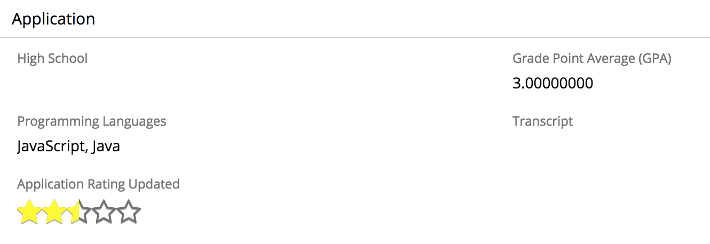

# Application Ratings

Professor M wants Sugar to make an intelligent recommendation on if an application should be accepted or rejected.  He
wants each application to have an automated rating from 0 to 5 stars.  Applicants earn stars based on their GPA and
the programming languages that they know.

Each star represents 20 points.  Applicants have the opportunity to earn a maximum of 100 points.  A student's GPA (on 
a scale of 0 to 4.0) is multiplied by 10 to give them up to 40 points.  Applicants can also earn points for the 
programming languages that they know.  Applicants earn 15 points each for PHP and Javascript.  Applicants earn 5 points
each for all other programming languages they know.

For example, if an applicant has a GPA of 3.0 and knows Javascript and Java, the applicant rating would be calculated 
in the following way.
- GPA of 3.0: 3.0 * 10 = 30 points
- Knowing Javascript: 15 points
- Knowing Java: 5 points
- Total: 50 points

50 points = 2.5 out of a possible 5 stars

## Implementation Technique

A [custom field type](http://support.sugarcrm.com/Documentation/Sugar_Developer/Sugar_Developer_Guide_7.9/User_Interface/Fields/Creating_Custom_Fields/)
was created in Sugar for the Star Rating. 

## Implementation Details

We created a 
[custom field type](http://support.sugarcrm.com/Documentation/Sugar_Developer/Sugar_Developer_Guide_7.9/User_Interface/Fields/Creating_Custom_Fields/) 
named `Rating (stars)`.  `Rating (stars)` is a field type that displays 5 stars and fills in the stars
 based on a calculated value.  This field type is a slightly modified version of the one
provided by sugarcrmlabs:  [RatingStarField](https://github.com/sugarcrmlabs/RatingStarField).

We created a 
[custom field](http://support.sugarcrm.com/Documentation/Sugar_Versions/7.9/Ent/Administration_Guide/Developer_Tools/Studio/#Creating_Fields)
named `programmingscore_c` in the Applicants (Leads) module.  The `programmingscore_c` field is not displayed in any
views.  The job of the `programmingscore_c` field is to hold the applicant's score for the programming languages
they know.  Because we can't use Sugar Logic with MultiSelect fields, we use a 
[before_save logic hook](http://support.sugarcrm.com/Documentation/Sugar_Developer/Sugar_Developer_Guide_8.1/Architecture/Logic_Hooks/Module_Hooks/before_save/index.html)
to update this field whenever an update is made to the `programminglanguages_c` field.  The files associated with the
logic hook are 
[update_applicant_programming_language_score.php](../package/src/custom/Extension/modules/Leads/Ext/LogicHooks/update_applicant_programming_language_score.php)
and 
[ApplicantProgrammingScore.php](../package/src/custom/modules/Leads/ApplicantProgrammingScore.php).

We created a 
[custom field](http://support.sugarcrm.com/Documentation/Sugar_Versions/7.9/Ent/Administration_Guide/Developer_Tools/Studio/#Creating_Fields)
named `rating_c` in the Applicants (Leads) module.  The `rating_c` field is of type `Rating (stars)`.  The 
`rating_c` field uses 
[Sugar Logic](http://support.sugarcrm.com/Knowledge_Base/Studio_and_Module_Builder/Sugar_Logic/index.html) to calculate 
the application's rating.  The formula it uses to sum the points for the applicant's GPA and programming score is 
`add(multiply($gpa_c,10),$programming_score_c)`.

We also updated the existing `gpa_c` field to have 
[custom field validation](http://support.sugarcrm.com/Documentation/Sugar_Developer/Sugar_Developer_Guide_8.0/Cookbook/Adding_Field_Validation_to_the_Record_View/index.html) 
so the value must be at least 0 but not higher than 4.0.  The files associated with the custom field validation are
[create.js](../package/src/custom/modules/Leads/clients/base/views/create/create.js), 
[record.js](../package/src/custom/modules/Leads/clients/base/views/record/record.js), and
[en_us.error_custom_message.php](../package/src/custom/Extension/application/Ext/Language/en_us.error_custom_message.php).

## Extensions

| Module | Extension | Name | Description |
| --- | --- | ---| ---|
| Leads | Vardefs | `rating_c` | "Rating (stars)" field that displays the applicant's rating. |
| Leads | Vardefs | `programmingscore_c` | Float field that holds the applicant's programming score. This field is not displayed. |
| Leads | LogicHooks | `update_applicant_programming_language_score` | A before_save logic hook that updates the applicant (lead) Programming Language Score field. |
| Application | Language | `ERROR_GPA_NOT_IN_RANGE` | Custom error message for when the GPA is not in a valid range. This error message is used by the custom field validation for `gpa_c`. |

## View Customizations
| Module | View | Description |
| --- | --- | ---|
| Leads | Record | The `rating_c` field has been added to a new row in the Application panel. |
| Leads | Create and Record |  Custom validation has been added to the `gpa_c` field to ensure the value is within a valid range. | 

## Pull Request

The pull request associated with these changes is [#97](https://github.com/sugarcrm/school/pull/97).

## Trying the Use Case

Create a new Applicant record.  In the Application panel, input a GPA and/or programming languages.  Note that the 
stars in the Application Rating field are automatically updated.
